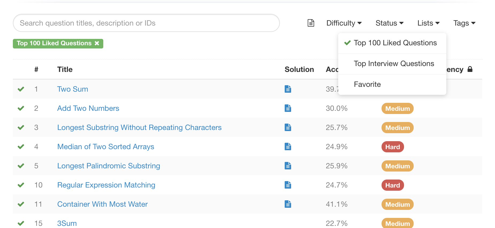

LeetCode Top 100 Liked Questions
===
</a>

The user's favorite 100 problems are very classic. If you are a newbie, this is the best way to get started with leetcode.

Language: Java

*If there was something wrong, you can new a issue. 
Welcome to improve this project with me.*  

---

用户最喜欢的100道题都是很经典的问题，是新手入门 leetcode 的最好方式。**每道题在代码头部都添加了我的解题思路和想法，希望对你有用**。

语言: Java

*相关问题可以直接提交一个issue，欢迎和我一起完善这个项目*  

---

### Top 100 Liked Questions

| \# | Problems | Difficulty | Solution |
|----|----------|-----------|------|
| 001  | [Two_Sum](https://leetcode.com/problems/two-sum/)  | Easy | [Java](./code/lc1.java)
| 002  | [Add Two Numbers](https://leetcode.com/problems/add-two-numbers/) |Medium| [Java](./code/lc2.java)
| 003  | [Longest Substring Without Repeating Characters](https://leetcode.com/problems/longest-substring-without-repeating-characters/) | Medium | [Java](./code/lc3.java)
| 004  | [Median of Two Sorted Arrays](https://leetcode.com/problems/median-of-two-sorted-arrays) | Hard | [Java](./code/lc4.java)
| 005  | [Longest Palindromic Substring](https://leetcode.com/problems/longest-palindromic-substring/) |Medium|[Java]
| 010  | [Regular Expression Matching](https://leetcode.com/problems/regular-expression-matching/) | Hard | [Java]
| 011  | [Container With Most Water](https://leetcode.com/problems/container-with-most-water/) |Medium| [Java]
| 015  | [3Sum](https://leetcode.com/problems/3sum/) |Medium| [Java]
| 017  | [Letter Combinations of a Phone Number](https://leetcode.com/problems/letter-combinations-of-a-phone-number/) |Medium| [Java]
| 019  | [Remove Nth Node From End of List](https://leetcode.com/problems/remove-nth-node-from-end-of-list/) | Easy | [Java]
| 020  | [Valid Parentheses](https://leetcode.com/problems/valid-parentheses/) | Easy | [Java]
| 021  | [Merge Two Sorted Lists](https://leetcode.com/problems/merge-two-sorted-lists/) | Easy | [Java]
| 022  | [Generate Parentheses](https://leetcode.com/problems/generate-parentheses/) |Medium| [Java] 
| 023  | [Merge k Sorted Lists](https://leetcode.com/problems/merge-k-sorted-lists/) | Hard | [Java]
| 032  | [Longest Valid Parentheses](https://leetcode.com/problems/longest-valid-parentheses/) | Hard | [Java]
| 033  | [Search in Rotated Sorted Array](https://leetcode.com/problems/search-in-rotated-sorted-array/) |Medium| [Java]
| 034  | [Search for a Range](https://leetcode.com/problems/search-for-a-range/) |Medium| [Java]
| 035  | [Search Insert Position](https://leetcode.com/problems/search-insert-position/) |Medium| [Java]
| 039  | [Combination Sum](https://leetcode.com/problems/combination-sum/) |Medium| [Java]
| 042  | [Trapping Rain Water](https://leetcode.com/problems/trapping-rain-water/) | Hard | [Java]
| 046  | [Permutations](https://leetcode.com/problems/permutations/)  |Medium| [Java] |
| 048  | [Rotate Image](https://leetcode.com/problems/rotate-image/)  |Medium| [Java]
| 049  | [Group Anagrams](https://leetcode.com/problems/anagrams/)|Medium| [Java]
| 053  | [Maximum Subarray](https://leetcode.com/problems/maximum-subarray/) |Medium| [Java]
| 055  | [Jump Game](https://leetcode.com/problems/jump-game/)  |Medium| [Java]
| 056  | [Merge Intervals](https://leetcode.com/problems/merge-intervals/) |Medium| [Java]
| 062  | [Unique Paths](https://leetcode.com/problems/unique-paths/)  |Medium| [Java]
| 064  | [Minimum Path Sum](https://leetcode.com/problems/minimum-path-sum/) |Medium| [Java]
| 070  | [Climbing Stairs](https://leetcode.com/problems/climbing-stairs/) | Easy | [Java]
| 072  | [Edit Distance](https://leetcode.com/problems/edit-distance/) | Hard | [Java]
| 075  | [Sort Colors](https://leetcode.com/problems/sort-colors/)|Medium| [Java]
| 076  | [Minimum Window Substring](https://leetcode.com/problems/minimum-window-substring) | Hard| [Java] 
| 078  | [Subsets](https://leetcode.com/problems/subsets/) |Medium| [Java]
| 079  | [Word Search](https://leetcode.com/problems/word-search/)|Medium| [Java]
| 084  | [Largest Rectangle in Histogram](https://leetcode.com/problems/largest-rectangle-in-histogram) | Hard | [Java]
| 085  | [Maximal Rectangle](https://leetcode.com/problems/maximal-rectangle) | Hard |[Java]
| 094  | [Binary Tree Inorder Traversal](https://leetcode.com/problems/binary-tree-inorder-traversal/) |Medium| [Java]
| 096  | [Unique Binary Search Trees](https://leetcode.com/problems/unique-binary-search-trees/) |Medium| [Java]
| 098  | [Validate Binary Search Tree](https://leetcode.com/problems/validate-binary-search-tree/) |Medium| [Java]
| 100  | [Same Tree](https://leetcode.com/problems/same-tree/)  | Easy | [Java]
| 101  | [Symmetric Tree](https://leetcode.com/problems/symmetric-tree/) | Easy | [Java]
| 102  | [Binary Tree Level Order Traversal](https://leetcode.com/problems/binary-tree-level-order-traversal/) | Easy | [Java]
| 104  | [Maximum Depth of Binary Tree](https://leetcode.com/problems/maximum-depth-of-binary-tree/) | Easy | [Java]
| 105  | [Construct Binary Tree from Preorder and Inorder Traversal](https://leetcode.com/problems/construct-binary-tree-from-preorder-and-inorder-traversal/) |Medium| [Java]
| 114  | [Flatten Binary Tree to Linked List](https://leetcode.com/problems/flatten-binary-tree-to-linked-list/) |Medium| [Java]
| 121  | [Best Time to Buy and Sell Stock](https://leetcode.com/problems/best-time-to-buy-and-sell-stock/) | Easy | [Java]
| 124  | [Binary Tree Maximum Path Sum](https://leetcode.com/problems/binary-tree-maximum-path-sum/) | Hard | [Java]
| 128  | [Longest Consecutive Sequence](https://leetcode.com/problems/longest-consecutive-sequence/) | Hard | [Java]
| 136  | [Single Number](https://leetcode.com/problems/single-number) | Easy | [Java] 
| 139  | [Word Break](https://leetcode.com/problems/word-break/) |Medium| [Java]
| 141  | [Linked List Cycle](https://leetcode.com/problems/linked-list-cycle/) | Easy | [Java]
| 142  | [Linked List Cycle II](https://leetcode.com/problems/linked-list-cycle-ii/) |Medium| [Java]
| 146  | [LRU Cache](https://leetcode.com/problems/lru-cache/)  | Hard | [Java] |
| 148  | [Sort List](https://leetcode.com/problems/sort-list/)  |Medium| [Java]
| 152  | [Maximum Product Subarray](https://leetcode.com/problems/maximum-product-subarray/) |Medium| [Java]
| 155  | [Min Stack](https://leetcode.com/problems/min-stack/)  | Easy | [Java]
| 160  | [Intersection of Two Linked Lists](https://leetcode.com/problems/intersection-of-two-linked-lists/) | Easy | [Java]
| 169  | [Majority Element](https://leetcode.com/problems/majority-element/) | Easy | [Java]
| 198  | [House Robber](https://leetcode.com/problems/house-robber/)  | Easy | [Java]
| 200  | [Number of Islands](https://leetcode.com/problems/number-of-islands/) |Medium| [Java]
| 206  | [Reverse Linked List](https://leetcode.com/problems/reverse-linked-list/) | Easy |[Java]
| 207  | [Course Schedule](https://leetcode.com/problems/course-schedule/) |Medium|[Java]
| 208  | [Implement Trie (Prefix Tree)](https://leetcode.com/problems/implement-trie-prefix-tree/) |Medium| [Java]
| 215  | [Kth Largest Element in an Array](https://leetcode.com/problems/kth-largest-element-in-an-array/) |Medium| [Java]
| 218  | [Subarray Sum Equals K](https://leetcode.com/problems/subarray-sum-equals-k) | Hard |[Java]
| 221  | [Maximal Square](https://leetcode.com/problems/maximal-square/) |Medium| [Java]
| 226  | [Invert Binary Tree](https://leetcode.com/problems/invert-binary-tree/) | Easy | [Java]
| 234  | [Palindrome Linked List](https://leetcode.com/problems/palindrome-linked-list/) | Easy | [Java]
| 236  | [Lowest Common Ancestor of a Binary Tree](https://leetcode.com/problems/lowest-common-ancestor-of-a-binary-tree/) |Medium| [Java]
| 238  | [Product of Array Except Self](https://leetcode.com/problems/product-of-array-except-self/) |Medium| [Java]
| 239  | [Sliding Window Maximum](https://leetcode.com/problems/sliding-window-maximum/) | Hard | [Java] |
| 240  | [Search a 2D Matrix II](https://leetcode.com/problems/search-a-2d-matrix-ii/) |Medium| [Java]
| 279  | [Perfect Squares](https://leetcode.com/problems/perfect-squares/) |Medium| [Java]
| 283  | [Move Zeroes](https://leetcode.com/problems/move-zeroes/)| Easy | [Java]
| 287  | [Find the Duplicate Number](https://leetcode.com/problems/find-the-duplicate-number/) | Hard | [Java]
| 297  | [Serialize and Deserialize Binary Tree](https://leetcode.com/problems/serialize-and-deserialize-binary-tree/) | Hard | [Java]
| 300  | [Longest Increasing Subsequence](https://leetcode.com/problems/longest-increasing-subsequence/) |Medium| [Java]
| 309  | [Best Time to Buy and Sell Stock with Cooldown](https://leetcode.com/problems/best-time-to-buy-and-sell-stock-with-cooldown/) |Medium| [Java]
| 312  | [Burst Balloons](https://leetcode.com/problems/burst-balloons/) | Hard | [Java]
| 322  | [Coin Change](https://leetcode.com/problems/coin-change/)|Medium| [Java]
| 337  | [House Robber III](https://leetcode.com/problems/house-robber-iii/) |Medium| [Java]
| 338  | [Counting Bits](https://leetcode.com/problems/counting-bits/) |Medium| [Java]
| 347  | [Top K Frequent Elements](https://leetcode.com/problems/top-k-frequent-elements/) |Medium| [Java]
| 394  | [Decode String](https://leetcode.com/problems/decode-string/) |Medium| [Java]
| 406  | [Queue Reconstruction by Height](https://leetcode.com/problems/queue-reconstruction-by-height/) |Medium| [Java]
| 416  | [Partition Equal Subset Sum](https://leetcode.com/problems/partition-equal-subset-sum/) |Medium| [Java]
| 437  | [Path Sum III](https://leetcode.com/problems/path-sum-iii/)  | Easy |[Java]
| 438  | [Find All Anagrams in a String](https://leetcode.com/problems/find-all-anagrams-in-a-string/) | Easy |[Java]
| 448  | [Find All Numbers Disappeared in an Array](https://leetcode.com/problems/find-all-numbers-disappeared-in-an-array/) | Easy |  [Java]
| 461  | [Hamming Distance](https://leetcode.com/problems/hamming-distance/) | Easy |[Java]
| 494  | [Target Sum](https://leetcode.com/problems/target-sum/) |Medium|[Java]
| 538  | [Convert BST to Greater Tree](https://leetcode.com/problems/convert-bst-to-greater-tree/description/) | Easy |[Java]
| 543  | [Diameter of Binary Tree](https://leetcode.com/problems/diameter-of-binary-tree/description/) | Easy | [Java]
| 560  | [Subarray Sum Equals K](https://leetcode.com/problems/subarray-sum-equals-k) |Medium| [Java]
| 572  | [Subtree of Another Tree](https://leetcode.com/problems/subtree-of-another-tree/description/) | Easy | [Java]
| 581  | [Shortest Unsorted Continuous Subarray](https://leetcode.com/problems/shortest-unsorted-continuous-subarray/description/) | Easy | [Java]
| 617  | [Merge Two Binary Trees](https://leetcode.com/problems/merge-two-binary-trees/description/) | Easy | [Java]
| 621  | [Task Scheduler](https://leetcode.com/problems/task-scheduler) |Medium|  [Java] |
| 647  | [Palindromic Substrings](https://leetcode.com/problems/palindromic-substrings) |Medium|[Java]

